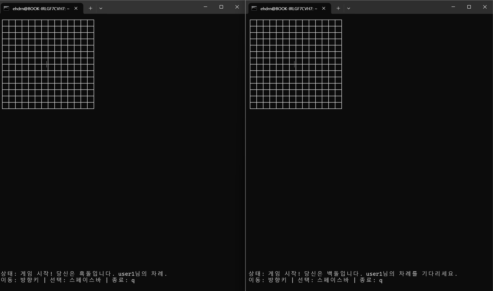
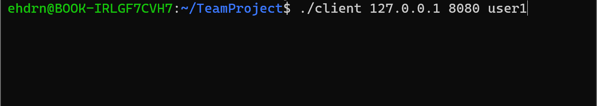
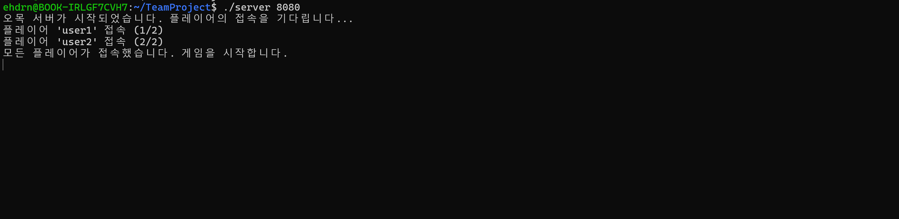
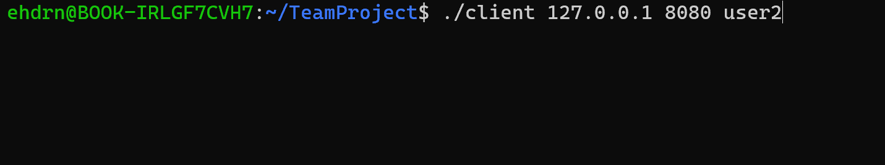

# SystemProgramming_TeamProject_22

# README.md

````markdown
# SystemProgramming_TeamProject_22

> C 언어와 POSIX 스레드를 활용한 클라이언트-서버 기반 오목(Gomoku) 게임 프로젝트

---

## 목차
- [소개](#소개)
- [디렉토리 구조](#디렉토리-구조)
- [게임 규칙](#게임-규칙)
- [환경 설정](#환경-설정)
- [컴파일 및 실행](#컴파일-및-실행)
- [인게임 사용법](#인게임-사용법)
- [전적 저장 및 로드](#전적-저장-및-로드)
- [알려진 이슈](#알려진-이슈)
- [기여 및 연락처](#기여-및-연락처)

---

## 소개
`SystemProgramming_TeamProject_22`는 C 언어와 POSIX 스레드를 이용해 클라이언트-서버 구조로 구현된 8인용 실시간 오목(Gomoku) 게임입니다. 플레이어 간 TCP 소켓 통신으로 게임 판 상태를 공유하며, 게임 전적을 파일에 저장합니다.

---

## 디렉토리 구조
```plaintext
SystemProgramming_TeamProject_22/
├─ client/              # 클라이언트 소스
│   └─ client.c
├─ server/              # 서버 소스
│   └─ server.c
├─ omok/                # 게임 로직
│   └─ omok.c
├─ protocol.h           # 클라이언트-서버 통신 프로토콜 정의
├─ gomoku_records.dat   # 게임 전적 저장 파일 (바이너리)
└─ Makefile             # 빌드 스크립트
````

---

## 게임 규칙

* **플레이어:** 총 2명
* **승리 조건:** 가로·세로·대각선으로 연속 5알 배치 시 승리
* **6목 금지:** 연속 6알 이상 배치는 불허

---

## 환경 설정

* **OS:** Ubuntu 18.04 / 20.04 LTS
* **언어:** C (POSIX Threads)
* **라이브러리:** pthread, standard C library
* **네트워크:** TCP/IP, localhost (127.0.0.1), 포트 자유 지정

---

## 컴파일 및 실행

### 컴파일

```bash
# 저장소 루트에서
$ make all
```

### 실행

```bash
# 서버 실행: 포트 지정
$ ./server [PORT]
# 예: ./server 9000

# 클라이언트 실행: 서버 IP, 포트, 사용자명
$ ./client [IP] [PORT] [NAME]
# 예: ./client 127.0.0.1 9000 Alice
```

---

## 인게임 사용법

* **플레이어 번호 표시:** 각 클라이언트에 자동 할당
* **플레이어 이름 입력:** 게임 시작 시 입력 가능
* **돌 놓기:** 방향키로 좌표 이동 후 스페이스바로 착수

---

## 게임화면

|  |  |
| :-----------------------------: | :-----------------------------: |
|  |  |

---

## 전적 저장 및 로드

* **gomoku\_records.dat** 파일에 승패 기록 바이너리 형태로 저장
* 서버 시작 시 자동 로드하여 이전 게임 통계 확인

---

## 알려진 이슈

* **6목 검출 오류:** 일부 경계 조건에서 6목 판별 누락 가능성
* **동시 접속 예외:** 클라이언트 연결 해제 시 서버 예외 처리 필요

---

## 기여 및 연락처

* PR과 이슈 환영합니다.
* **작성자:** 김시후 (sh990311@naver.com)
* **작성자:** 염동권 (ehdrnjs66@naver.com)
* **작성자:** 박수진 (ggiiaall2003@naver.com)


